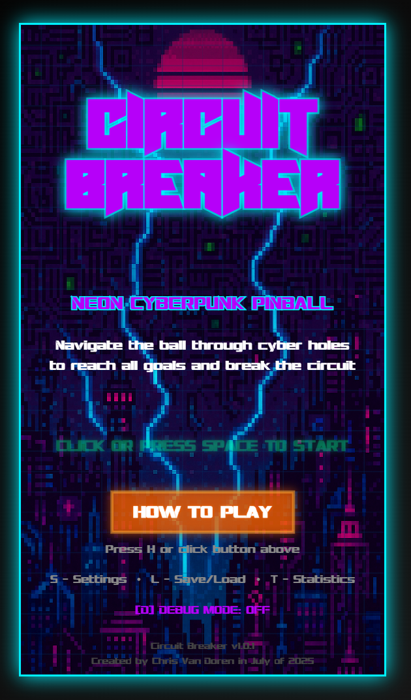

# Circuit Breaker

**A modern digital pinball game that reimagines the classic Ice Cold Beer arcade mechanics with a neon cyberpunk aesthetic.**

🎮 **[PLAY THE GAME NOW](https://sl4ppy.github.io/circuit-breaker/)** 🎮


*Circuit Breaker in action - Experience the neon cyberpunk pinball gameplay with professional loading screens, attract mode, and immersive audio-visual effects.*

## Game Concept

**"Navigate the digital frontier in Circuit Breaker - where every pixel pulses with neon energy and every move could fry your data packet. Master the art of precision tilting as you guide glowing data through a maze of live electrical nodes. Can you become the ultimate circuit runner?"**

### Core Mechanics
- **Realistic Pinball Physics**: Heavy steel ball with authentic weight and bounce
- **Tilting Bar Control**: Independent left/right bar movement for precise navigation
- **Level Progression**: Multi-goal system with increasing difficulty
- **Animated Holes System**: Dynamic holes that appear/disappear with spring animation (v1.0.0)
- **Power-Up Saucer System**: Pinball-style saucers that collect balls and grant power-ups
- **Dynamic Audio Feedback**: Velocity-based sound effects for all interactions

## Novel Technical Implementations

### Custom Physics Engine
- **Realistic Pinball Physics**: Heavy steel ball with 6x mass for authentic weight (80-100g equivalent)
- **Velocity-Based Audio Integration**: Collision sounds dynamically adapt to impact intensity
- **Complex Tilting Bar Mechanics**: Independent left/right control with realistic friction and bounce

### Procedural Audio System
- **Zero External Files**: All sounds generated mathematically using Web Audio API
- **Real-time Audio Generation**: Velocity-responsive pitch and volume adjustments
- **Dynamic Music System**: Seamless state-based transitions with browser-compliant audio handling

### Advanced Rendering Pipeline
- **Sprite Atlas System**: Professional sprite rendering with procedural fallbacks
- **Dynamic Depth Management**: Proper layering system (holes → bar/glow → ball)
- **Saucer Visual Effects**: Phase-specific animations for sinking, waiting, and ejecting
- **Attract Mode**: Automated gameplay demonstration with AI-controlled bar movement

## Roadmap

### 🚧 Current Focus
- **Particle Effects**: Electrical sparks and ball impact effects
- **Dynamic Lighting**: Enhanced glow effects around holes and bars
- **Mobile Optimization**: Touch controls and responsive design

### 📋 Upcoming Features
- **Level Editor**: Custom level creation tools
- **Leaderboard System**: Global high scores
- **Enhanced Power-ups**: Advanced power-up effects and combinations
- **Multiplayer**: Turn-based competitive gameplay

## Getting Started

```bash
# Clone and setup
git clone https://github.com/sl4ppy/circuit-breaker.git
cd circuit-breaker
npm install

# Development
npm run dev          # Start development server
npm run build        # Build for production
npm run deploy       # Deploy to GitHub Pages
```

## Controls

- **A/Z**: Control left side of bar (up/down)
- **↑/↓**: Control right side of bar (up/down)
- **SPACE**: Place/respawn ball

---

*Created by Chris Van Doren in July of 2025* 